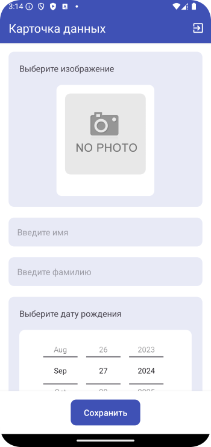
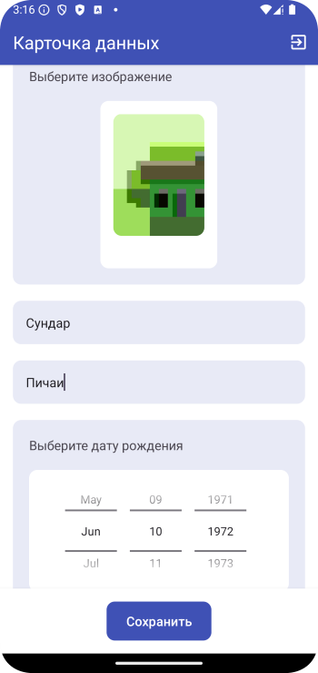
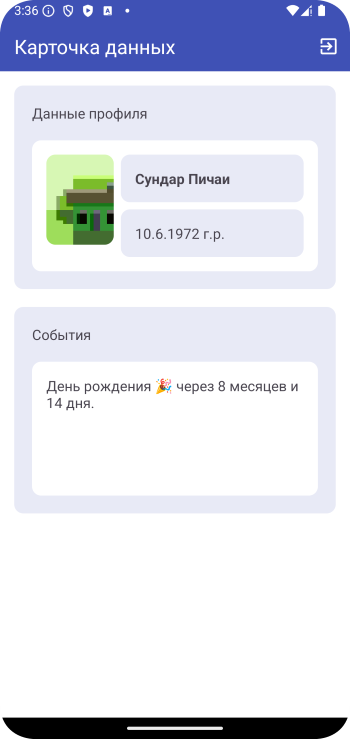
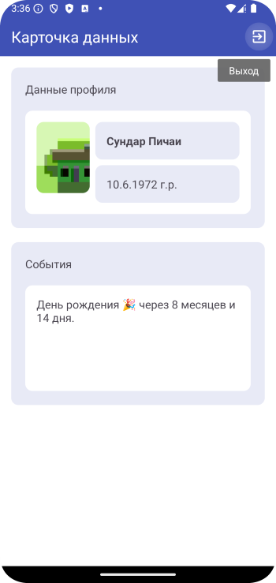
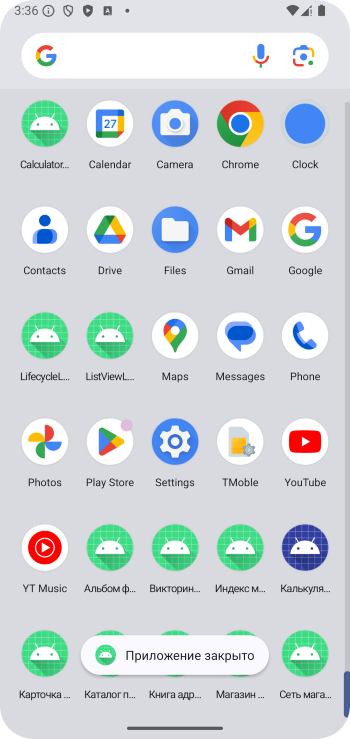

# Домашнее задание по теме "Date Prime"

### Приложение «Карточка данных».

Необходимо написать приложение, состоящее из двух экранов. На первом выполняется ввод данных
загружается фото из галереи, вводятся данные имени, фамилии, дата, месяц и год рождения, телефон. По
нажатию на кнопку «Сохранить» выполняется переход на страницу карточки данных. Все данные передаются
туда.

На втором экране находятся фото сохраненного объекта, фамилия, имя, телефон и данные о том сколько
ему лет и сколько дней и месяцев осталось до дня рождения. На втором экране есть возможность выхода
из приложения, используя пункт меню «Exit».

Для работы приложения необходимо создать:

На первом экране:

1. Поле ввода имени.

2. Поле ввода фамилии.

3. Поле ввода даты, месяца, года рождения.

4. Поле для размещения фото объекта.

5. Кнопка для сохранения данных в карточку «Сохранить».

На втором экране:

1. Поле вывода имени.

2. Поле вывода фамилии.

3. Поле вывода возраста объекта и количества месяцев и дней до дня рождения.

4. Поле размещения фото объекта.

6. Меню с пунктом «Exit».

Приложение необходимо сохранить проектом в удаленном репозитории, для проверки качества предоставить
ссылку преподавателю, либо сделать видео экрана реального устройства в процессе работы приложения.

### Скриншоты домашнего задания по теме "Date Prime"

Спойлер - здесь скриншоты

